## Hook Lifecycle

This page documents the **`ctx` system hooks**: the built-in
`ctx system *` subcommands that Claude Code invokes via
`.claude/hooks.json` at lifecycle events. These are owned by
`ctx` itself, not authored by users.

!!! info "Not to Be Confused with `ctx trigger`"
    `ctx` has **three distinct hook-like layers**:

    - **`ctx system` hooks** (this page): built-in, owned
      by `ctx`, wired into Claude Code via
      `internal/assets/claude/hooks/hooks.json`.
    - **`ctx trigger`**: user-authored shell scripts in
      `.context/hooks/<type>/*.sh`. See
      [`ctx trigger` reference](../cli/trigger.md) and the
      [trigger authoring recipe](triggers.md).
    - **Claude Code hooks** configured directly in
      `.claude/settings.local.json`, tool-specific, not
      portable across AI tools.

    This page is *only* about the first category.

Every `ctx system` hook is a Go binary invoked by Claude Code
at one of three lifecycle events: `PreToolUse` (before a tool
runs, can block), `PostToolUse` (after a tool completes), or
`UserPromptSubmit` (on every user prompt, before any tools
run). Hooks receive JSON on stdin and emit JSON or plain text
on stdout.

---

<!-- drift-check: jq -r '.hooks.PreToolUse[].hooks[].command' internal/assets/claude/hooks/hooks.json | grep '`ctx` system' | sed 's/ctx system //' | sort -->

## PreToolUse Hooks

These fire **before** a tool executes. They can block, gate, or
inject context.

### Context-Load-Gate

Matcher: `.*` (all tools)

Injects the full context packet on first tool use of a session.
One-shot per session.

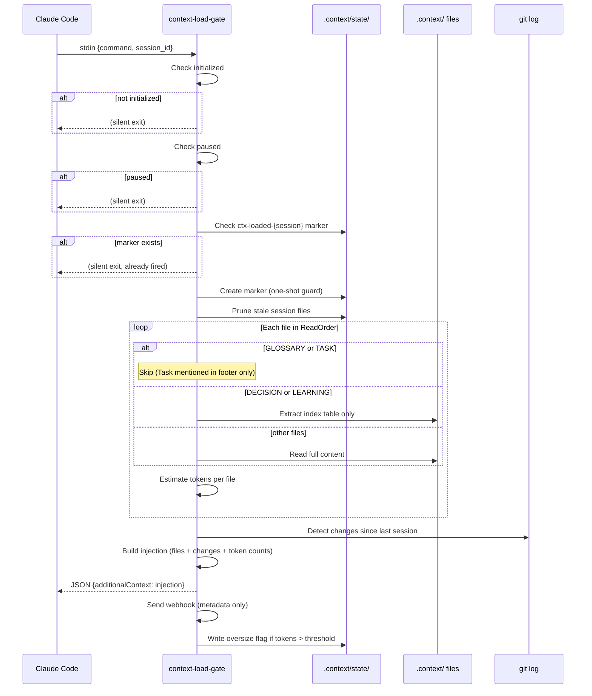
```mermaid
sequenceDiagram
    participant CC as Claude Code
    participant Hook as context-load-gate
    participant State as .context/state/
    participant Ctx as .context/ files
    participant Git as git log

    CC->>Hook: stdin {command, session_id}
    Hook->>Hook: Check initialized
    alt not initialized
        Hook-->>CC: (silent exit)
    end
    Hook->>Hook: Check paused
    alt paused
        Hook-->>CC: (silent exit)
    end
    Hook->>State: Check ctx-loaded-{session} marker
    alt marker exists
        Hook-->>CC: (silent exit, already fired)
    end
    Hook->>State: Create marker (one-shot guard)
    Hook->>State: Prune stale session files
    loop Each file in ReadOrder
        alt GLOSSARY or TASK
            Note over Hook: Skip (Task mentioned in footer only)
        else DECISION or LEARNING
            Hook->>Ctx: Extract index table only
        else other files
            Hook->>Ctx: Read full content
        end
        Hook->>Hook: Estimate tokens per file
    end
    Hook->>Git: Detect changes since last session
    Hook->>Hook: Build injection (files + changes + token counts)
    Hook-->>CC: JSON {additionalContext: injection}
    Hook->>Hook: Send webhook (metadata only)
    Hook->>State: Write oversize flag if tokens > threshold
```

### Block-Non-Path-ctx

Matcher: `Bash`

Blocks `./ctx`, `go run ./cmd/ctx`, or absolute-path `ctx`
invocations. Constitutionally enforced.

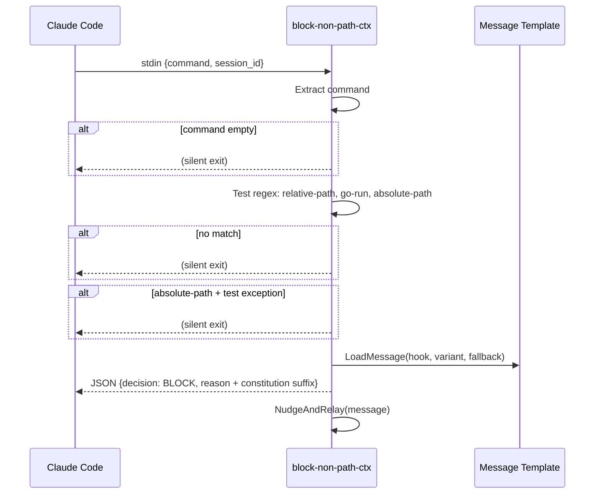
```mermaid
sequenceDiagram
    participant CC as Claude Code
    participant Hook as block-non-path-ctx
    participant Tpl as Message Template

    CC->>Hook: stdin {command, session_id}
    Hook->>Hook: Extract command
    alt command empty
        Hook-->>CC: (silent exit)
    end
    Hook->>Hook: Test regex: relative-path, go-run, absolute-path
    alt no match
        Hook-->>CC: (silent exit)
    end
    alt absolute-path + test exception
        Hook-->>CC: (silent exit)
    end
    Hook->>Tpl: LoadMessage(hook, variant, fallback)
    Hook-->>CC: JSON {decision: BLOCK, reason + constitution suffix}
    Hook->>Hook: NudgeAndRelay(message)
```

### Qa-Reminder

Matcher: `Bash`

Gate nudge before any git command. Reminds agent to lint/test.

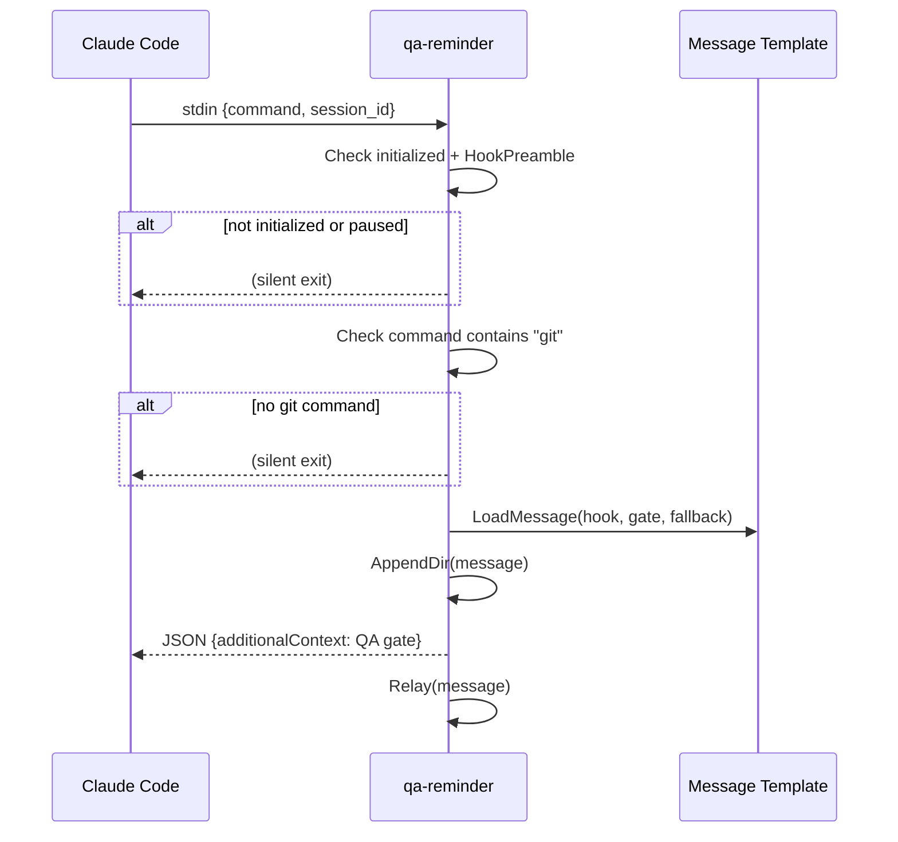
```mermaid
sequenceDiagram
    participant CC as Claude Code
    participant Hook as qa-reminder
    participant Tpl as Message Template

    CC->>Hook: stdin {command, session_id}
    Hook->>Hook: Check initialized + HookPreamble
    alt not initialized or paused
        Hook-->>CC: (silent exit)
    end
    Hook->>Hook: Check command contains "git"
    alt no git command
        Hook-->>CC: (silent exit)
    end
    Hook->>Tpl: LoadMessage(hook, gate, fallback)
    Hook->>Hook: AppendDir(message)
    Hook-->>CC: JSON {additionalContext: QA gate}
    Hook->>Hook: Relay(message)
```

### Specs-Nudge

Matcher: `EnterPlanMode`

Nudges agent to save plans/specs when new implementation detected.

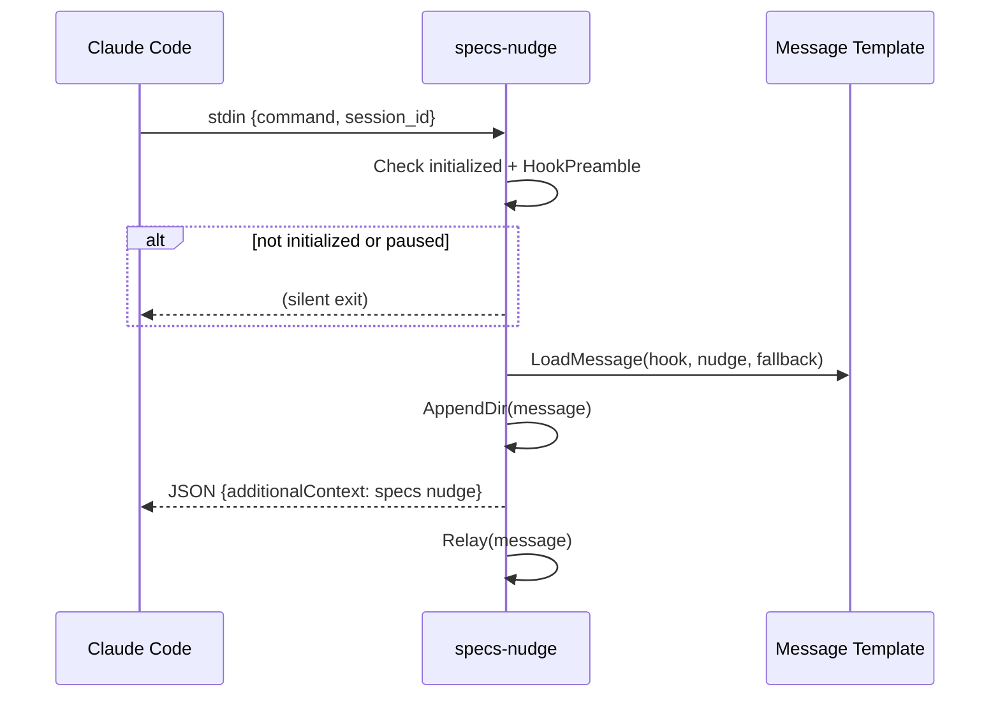
```mermaid
sequenceDiagram
    participant CC as Claude Code
    participant Hook as specs-nudge
    participant Tpl as Message Template

    CC->>Hook: stdin {command, session_id}
    Hook->>Hook: Check initialized + HookPreamble
    alt not initialized or paused
        Hook-->>CC: (silent exit)
    end
    Hook->>Tpl: LoadMessage(hook, nudge, fallback)
    Hook->>Hook: AppendDir(message)
    Hook-->>CC: JSON {additionalContext: specs nudge}
    Hook->>Hook: Relay(message)
```

---

<!-- drift-check: jq -r '.hooks.PostToolUse[].hooks[].command' internal/assets/claude/hooks/hooks.json | grep '`ctx` system' | sed 's/ctx system //' | sort -->

## PostToolUse Hooks

These fire **after** a tool completes. They observe, nudge, and
track state.

### Post-Commit

Matcher: `Bash`

Fires after `git commit` (not amend). Nudges for context capture
and checks version drift.

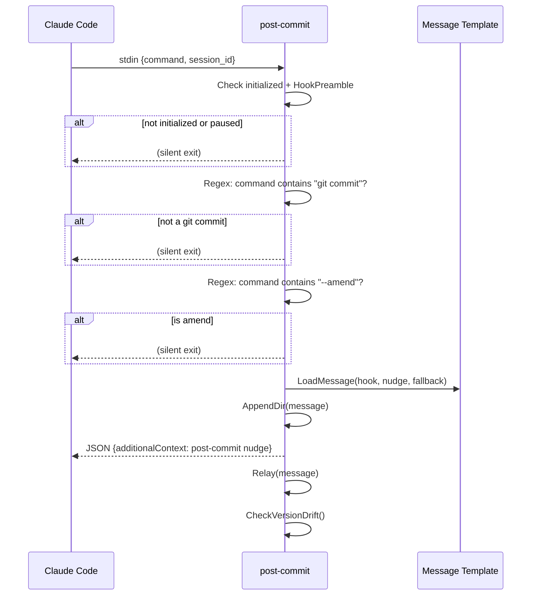
```mermaid
sequenceDiagram
    participant CC as Claude Code
    participant Hook as post-commit
    participant Tpl as Message Template

    CC->>Hook: stdin {command, session_id}
    Hook->>Hook: Check initialized + HookPreamble
    alt not initialized or paused
        Hook-->>CC: (silent exit)
    end
    Hook->>Hook: Regex: command contains "git commit"?
    alt not a git commit
        Hook-->>CC: (silent exit)
    end
    Hook->>Hook: Regex: command contains "--amend"?
    alt is amend
        Hook-->>CC: (silent exit)
    end
    Hook->>Tpl: LoadMessage(hook, nudge, fallback)
    Hook->>Hook: AppendDir(message)
    Hook-->>CC: JSON {additionalContext: post-commit nudge}
    Hook->>Hook: Relay(message)
    Hook->>Hook: CheckVersionDrift()
```

### Check-Task-Completion

Matcher: `Edit`, `Write`

Configurable-interval nudge after edits. Per-session counter resets
after firing.

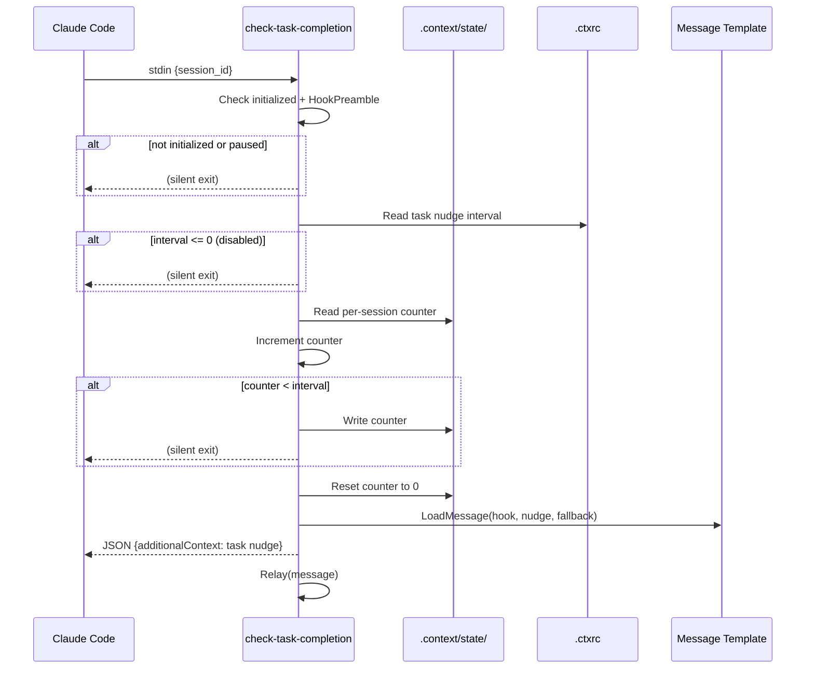
```mermaid
sequenceDiagram
    participant CC as Claude Code
    participant Hook as check-task-completion
    participant State as .context/state/
    participant RC as .ctxrc
    participant Tpl as Message Template

    CC->>Hook: stdin {session_id}
    Hook->>Hook: Check initialized + HookPreamble
    alt not initialized or paused
        Hook-->>CC: (silent exit)
    end
    Hook->>RC: Read task nudge interval
    alt interval <= 0 (disabled)
        Hook-->>CC: (silent exit)
    end
    Hook->>State: Read per-session counter
    Hook->>Hook: Increment counter
    alt counter < interval
        Hook->>State: Write counter
        Hook-->>CC: (silent exit)
    end
    Hook->>State: Reset counter to 0
    Hook->>Tpl: LoadMessage(hook, nudge, fallback)
    Hook-->>CC: JSON {additionalContext: task nudge}
    Hook->>Hook: Relay(message)
```

---

<!-- drift-check: jq -r '.hooks.UserPromptSubmit[].hooks[].command' internal/assets/claude/hooks/hooks.json | sed 's/ctx system //' | sort -->

## UserPromptSubmit Hooks

These fire **on every user prompt**, before any tools run. They
perform health checks, track state, and nudge for housekeeping.

### Check-Context-Size

Adaptive context window monitoring. Fires checkpoints, window
warnings, and billing alerts based on prompt count and token usage.

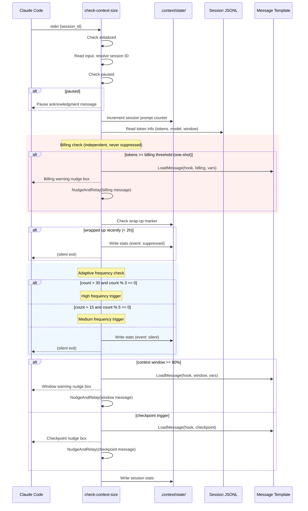
```mermaid
sequenceDiagram
    participant CC as Claude Code
    participant Hook as check-context-size
    participant State as .context/state/
    participant Session as Session JSONL
    participant Tpl as Message Template

    CC->>Hook: stdin {session_id}
    Hook->>Hook: Check initialized
    Hook->>Hook: Read input, resolve session ID
    Hook->>Hook: Check paused
    alt paused
        Hook-->>CC: Pause acknowledgment message
    end
    Hook->>State: Increment session prompt counter
    Hook->>Session: Read token info (tokens, model, window)

    rect rgb(255, 240, 240)
        Note over Hook: Billing check (independent, never suppressed)
        alt tokens >= billing threshold (one-shot)
            Hook->>Tpl: LoadMessage(hook, billing, vars)
            Hook-->>CC: Billing warning nudge box
            Hook->>Hook: NudgeAndRelay(billing message)
        end
    end

    Hook->>State: Check wrap-up marker
    alt wrapped up recently (< 2h)
        Hook->>State: Write stats (event: suppressed)
        Hook-->>CC: (silent exit)
    end

    rect rgb(240, 248, 255)
        Note over Hook: Adaptive frequency check
        alt count > 30 and count % 3 == 0
            Note over Hook: High frequency trigger
        else count > 15 and count % 5 == 0
            Note over Hook: Medium frequency trigger
        else
            Hook->>State: Write stats (event: silent)
            Hook-->>CC: (silent exit)
        end
    end

    alt context window >= 80%
        Hook->>Tpl: LoadMessage(hook, window, vars)
        Hook-->>CC: Window warning nudge box
        Hook->>Hook: NudgeAndRelay(window message)
    else checkpoint trigger
        Hook->>Tpl: LoadMessage(hook, checkpoint)
        Hook-->>CC: Checkpoint nudge box
        Hook->>Hook: NudgeAndRelay(checkpoint message)
    end
    Hook->>State: Write session stats
```

### Check-Ceremonies

Daily check for `/ctx-remember` and `/ctx-wrap-up` usage in
recent journal entries.

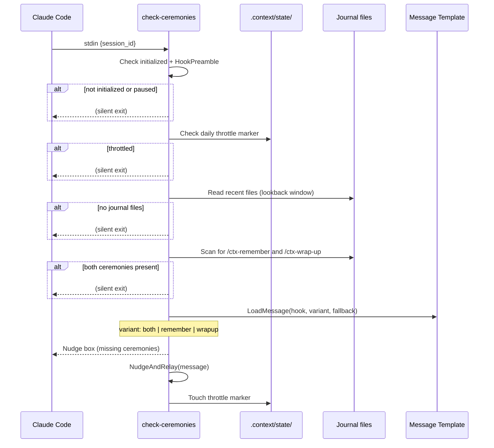
```mermaid
sequenceDiagram
    participant CC as Claude Code
    participant Hook as check-ceremonies
    participant State as .context/state/
    participant Journal as Journal files
    participant Tpl as Message Template

    CC->>Hook: stdin {session_id}
    Hook->>Hook: Check initialized + HookPreamble
    alt not initialized or paused
        Hook-->>CC: (silent exit)
    end
    Hook->>State: Check daily throttle marker
    alt throttled
        Hook-->>CC: (silent exit)
    end
    Hook->>Journal: Read recent files (lookback window)
    alt no journal files
        Hook-->>CC: (silent exit)
    end
    Hook->>Journal: Scan for /ctx-remember and /ctx-wrap-up
    alt both ceremonies present
        Hook-->>CC: (silent exit)
    end
    Hook->>Tpl: LoadMessage(hook, variant, fallback)
    Note over Hook: variant: both | remember | wrapup
    Hook-->>CC: Nudge box (missing ceremonies)
    Hook->>Hook: NudgeAndRelay(message)
    Hook->>State: Touch throttle marker
```

### Check-Freshness

Daily check for technology-dependent constants that may need review.

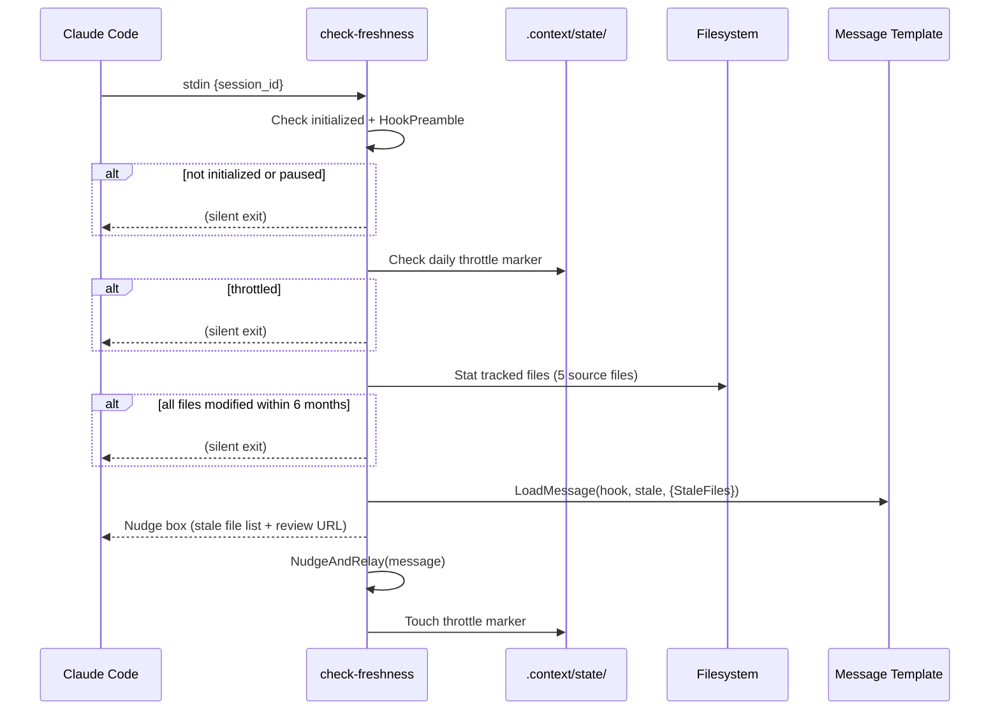
```mermaid
sequenceDiagram
    participant CC as Claude Code
    participant Hook as check-freshness
    participant State as .context/state/
    participant FS as Filesystem
    participant Tpl as Message Template

    CC->>Hook: stdin {session_id}
    Hook->>Hook: Check initialized + HookPreamble
    alt not initialized or paused
        Hook-->>CC: (silent exit)
    end
    Hook->>State: Check daily throttle marker
    alt throttled
        Hook-->>CC: (silent exit)
    end
    Hook->>FS: Stat tracked files (5 source files)
    alt all files modified within 6 months
        Hook-->>CC: (silent exit)
    end
    Hook->>Tpl: LoadMessage(hook, stale, {StaleFiles})
    Hook-->>CC: Nudge box (stale file list + review URL)
    Hook->>Hook: NudgeAndRelay(message)
    Hook->>State: Touch throttle marker
```

### Check-Journal

Daily check for unimported sessions and unenriched journal entries.

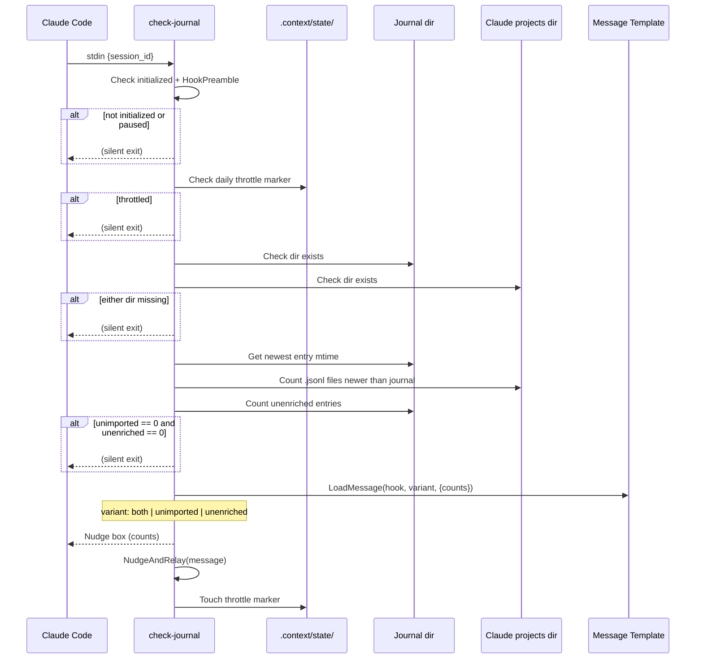
```mermaid
sequenceDiagram
    participant CC as Claude Code
    participant Hook as check-journal
    participant State as .context/state/
    participant Journal as Journal dir
    participant Claude as Claude projects dir
    participant Tpl as Message Template

    CC->>Hook: stdin {session_id}
    Hook->>Hook: Check initialized + HookPreamble
    alt not initialized or paused
        Hook-->>CC: (silent exit)
    end
    Hook->>State: Check daily throttle marker
    alt throttled
        Hook-->>CC: (silent exit)
    end
    Hook->>Journal: Check dir exists
    Hook->>Claude: Check dir exists
    alt either dir missing
        Hook-->>CC: (silent exit)
    end
    Hook->>Journal: Get newest entry mtime
    Hook->>Claude: Count .jsonl files newer than journal
    Hook->>Journal: Count unenriched entries
    alt unimported == 0 and unenriched == 0
        Hook-->>CC: (silent exit)
    end
    Hook->>Tpl: LoadMessage(hook, variant, {counts})
    Note over Hook: variant: both | unimported | unenriched
    Hook-->>CC: Nudge box (counts)
    Hook->>Hook: NudgeAndRelay(message)
    Hook->>State: Touch throttle marker
```

### Check-Knowledge

Daily check for knowledge file entry/line counts exceeding
configured thresholds.

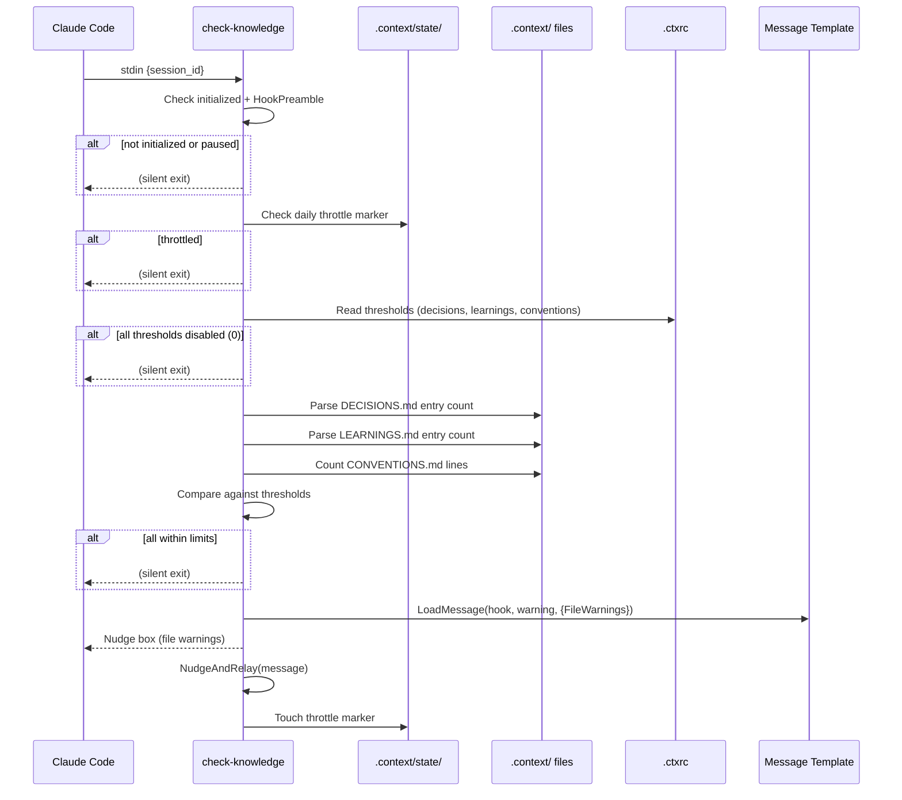
```mermaid
sequenceDiagram
    participant CC as Claude Code
    participant Hook as check-knowledge
    participant State as .context/state/
    participant Ctx as .context/ files
    participant RC as .ctxrc
    participant Tpl as Message Template

    CC->>Hook: stdin {session_id}
    Hook->>Hook: Check initialized + HookPreamble
    alt not initialized or paused
        Hook-->>CC: (silent exit)
    end
    Hook->>State: Check daily throttle marker
    alt throttled
        Hook-->>CC: (silent exit)
    end
    Hook->>RC: Read thresholds (decisions, learnings, conventions)
    alt all thresholds disabled (0)
        Hook-->>CC: (silent exit)
    end
    Hook->>Ctx: Parse DECISIONS.md entry count
    Hook->>Ctx: Parse LEARNINGS.md entry count
    Hook->>Ctx: Count CONVENTIONS.md lines
    Hook->>Hook: Compare against thresholds
    alt all within limits
        Hook-->>CC: (silent exit)
    end
    Hook->>Tpl: LoadMessage(hook, warning, {FileWarnings})
    Hook-->>CC: Nudge box (file warnings)
    Hook->>Hook: NudgeAndRelay(message)
    Hook->>State: Touch throttle marker
```

### Check-Map-Staleness

Daily check for architecture map age and relevant code changes.

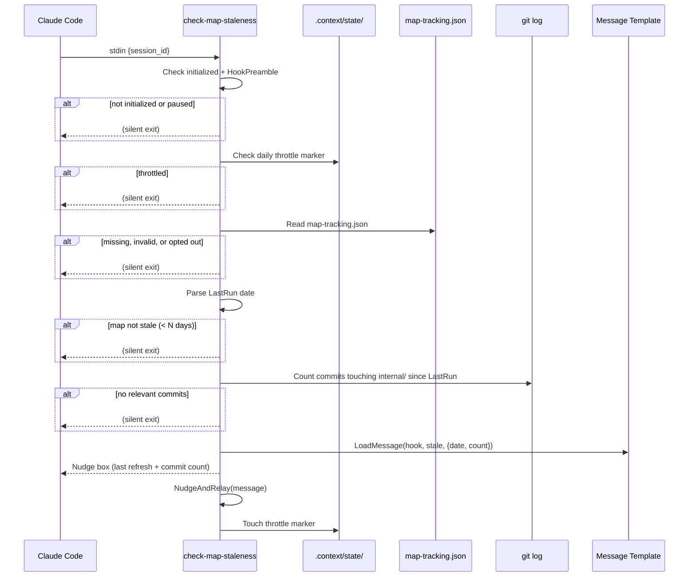
```mermaid
sequenceDiagram
    participant CC as Claude Code
    participant Hook as check-map-staleness
    participant State as .context/state/
    participant Tracking as map-tracking.json
    participant Git as git log
    participant Tpl as Message Template

    CC->>Hook: stdin {session_id}
    Hook->>Hook: Check initialized + HookPreamble
    alt not initialized or paused
        Hook-->>CC: (silent exit)
    end
    Hook->>State: Check daily throttle marker
    alt throttled
        Hook-->>CC: (silent exit)
    end
    Hook->>Tracking: Read map-tracking.json
    alt missing, invalid, or opted out
        Hook-->>CC: (silent exit)
    end
    Hook->>Hook: Parse LastRun date
    alt map not stale (< N days)
        Hook-->>CC: (silent exit)
    end
    Hook->>Git: Count commits touching internal/ since LastRun
    alt no relevant commits
        Hook-->>CC: (silent exit)
    end
    Hook->>Tpl: LoadMessage(hook, stale, {date, count})
    Hook-->>CC: Nudge box (last refresh + commit count)
    Hook->>Hook: NudgeAndRelay(message)
    Hook->>State: Touch throttle marker
```

### Check-Memory-Drift

Per-session check for MEMORY.md changes since last sync.

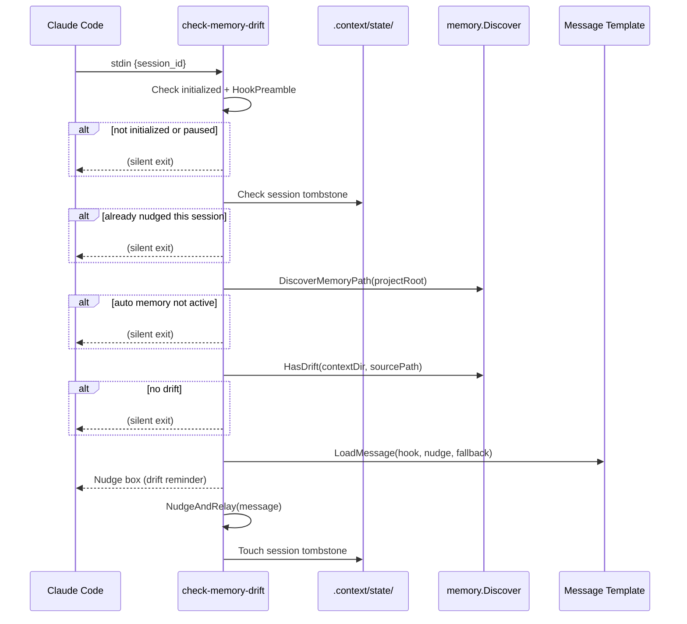
```mermaid
sequenceDiagram
    participant CC as Claude Code
    participant Hook as check-memory-drift
    participant State as .context/state/
    participant Mem as memory.Discover
    participant Tpl as Message Template

    CC->>Hook: stdin {session_id}
    Hook->>Hook: Check initialized + HookPreamble
    alt not initialized or paused
        Hook-->>CC: (silent exit)
    end
    Hook->>State: Check session tombstone
    alt already nudged this session
        Hook-->>CC: (silent exit)
    end
    Hook->>Mem: DiscoverMemoryPath(projectRoot)
    alt auto memory not active
        Hook-->>CC: (silent exit)
    end
    Hook->>Mem: HasDrift(contextDir, sourcePath)
    alt no drift
        Hook-->>CC: (silent exit)
    end
    Hook->>Tpl: LoadMessage(hook, nudge, fallback)
    Hook-->>CC: Nudge box (drift reminder)
    Hook->>Hook: NudgeAndRelay(message)
    Hook->>State: Touch session tombstone
```

### Check-Persistence

Tracks context file modification and nudges when edits happen
without persisting context. Adaptive threshold based on prompt count.

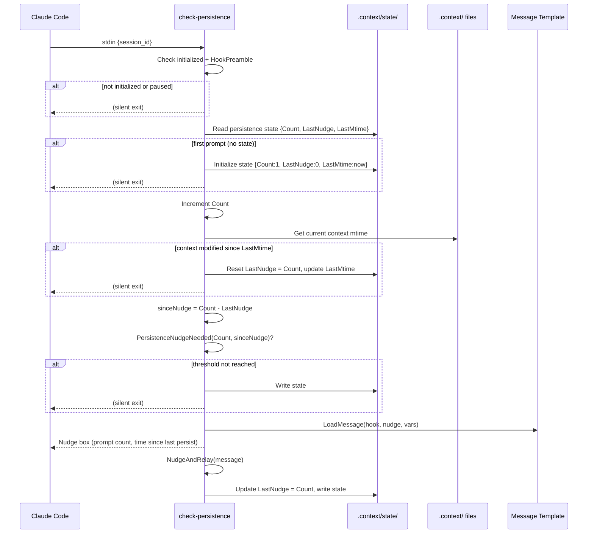
```mermaid
sequenceDiagram
    participant CC as Claude Code
    participant Hook as check-persistence
    participant State as .context/state/
    participant Ctx as .context/ files
    participant Tpl as Message Template

    CC->>Hook: stdin {session_id}
    Hook->>Hook: Check initialized + HookPreamble
    alt not initialized or paused
        Hook-->>CC: (silent exit)
    end
    Hook->>State: Read persistence state {Count, LastNudge, LastMtime}
    alt first prompt (no state)
        Hook->>State: Initialize state {Count:1, LastNudge:0, LastMtime:now}
        Hook-->>CC: (silent exit)
    end
    Hook->>Hook: Increment Count
    Hook->>Ctx: Get current context mtime
    alt context modified since LastMtime
        Hook->>State: Reset LastNudge = Count, update LastMtime
        Hook-->>CC: (silent exit)
    end
    Hook->>Hook: sinceNudge = Count - LastNudge
    Hook->>Hook: PersistenceNudgeNeeded(Count, sinceNudge)?
    alt threshold not reached
        Hook->>State: Write state
        Hook-->>CC: (silent exit)
    end
    Hook->>Tpl: LoadMessage(hook, nudge, vars)
    Hook-->>CC: Nudge box (prompt count, time since last persist)
    Hook->>Hook: NudgeAndRelay(message)
    Hook->>State: Update LastNudge = Count, write state
```

### Check-Reminders

Per-prompt check for due reminders. No throttle.

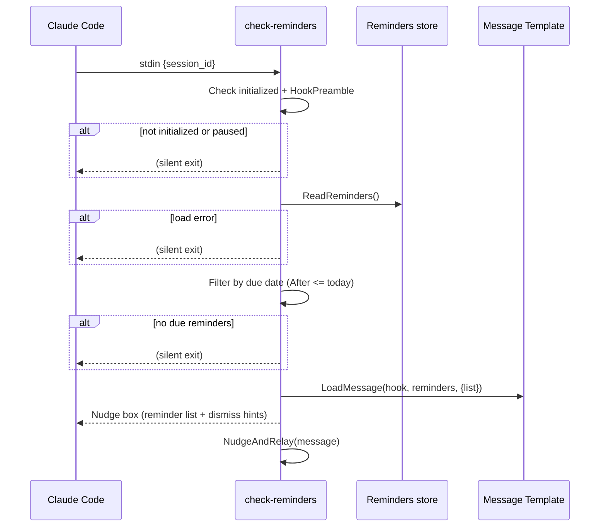
```mermaid
sequenceDiagram
    participant CC as Claude Code
    participant Hook as check-reminders
    participant Store as Reminders store
    participant Tpl as Message Template

    CC->>Hook: stdin {session_id}
    Hook->>Hook: Check initialized + HookPreamble
    alt not initialized or paused
        Hook-->>CC: (silent exit)
    end
    Hook->>Store: ReadReminders()
    alt load error
        Hook-->>CC: (silent exit)
    end
    Hook->>Hook: Filter by due date (After <= today)
    alt no due reminders
        Hook-->>CC: (silent exit)
    end
    Hook->>Tpl: LoadMessage(hook, reminders, {list})
    Hook-->>CC: Nudge box (reminder list + dismiss hints)
    Hook->>Hook: NudgeAndRelay(message)
```

### Check-Resources

Checks system resources (memory, swap, disk, load). Fires on
every prompt. No initialization required.

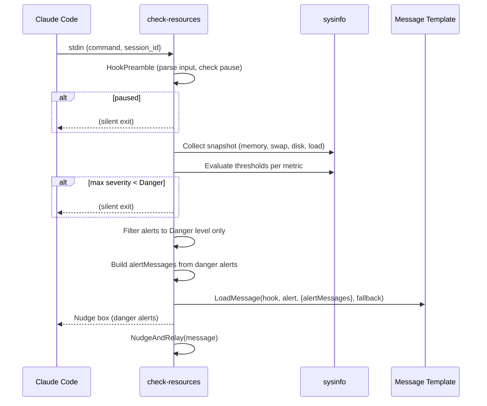
```mermaid
sequenceDiagram
    participant CC as Claude Code
    participant Hook as check-resources
    participant Sys as sysinfo
    participant Tpl as Message Template

    CC->>Hook: stdin {command, session_id}
    Hook->>Hook: HookPreamble (parse input, check pause)
    alt paused
        Hook-->>CC: (silent exit)
    end
    Hook->>Sys: Collect snapshot (memory, swap, disk, load)
    Hook->>Sys: Evaluate thresholds per metric
    alt max severity < Danger
        Hook-->>CC: (silent exit)
    end
    Hook->>Hook: Filter alerts to Danger level only
    Hook->>Hook: Build alertMessages from danger alerts
    Hook->>Tpl: LoadMessage(hook, alert, {alertMessages}, fallback)
    Hook-->>CC: Nudge box (danger alerts)
    Hook->>Hook: NudgeAndRelay(message)
```

### Check-Version

Daily binary-vs-plugin version comparison with piggybacked key
rotation check.

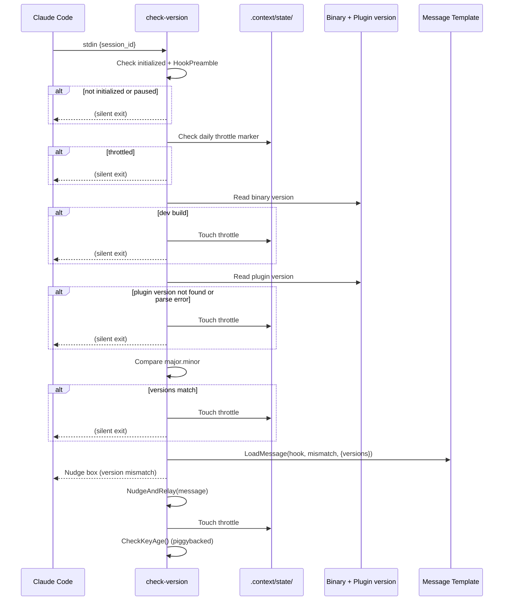
```mermaid
sequenceDiagram
    participant CC as Claude Code
    participant Hook as check-version
    participant State as .context/state/
    participant Config as Binary + Plugin version
    participant Tpl as Message Template

    CC->>Hook: stdin {session_id}
    Hook->>Hook: Check initialized + HookPreamble
    alt not initialized or paused
        Hook-->>CC: (silent exit)
    end
    Hook->>State: Check daily throttle marker
    alt throttled
        Hook-->>CC: (silent exit)
    end
    Hook->>Config: Read binary version
    alt dev build
        Hook->>State: Touch throttle
        Hook-->>CC: (silent exit)
    end
    Hook->>Config: Read plugin version
    alt plugin version not found or parse error
        Hook->>State: Touch throttle
        Hook-->>CC: (silent exit)
    end
    Hook->>Hook: Compare major.minor
    alt versions match
        Hook->>State: Touch throttle
        Hook-->>CC: (silent exit)
    end
    Hook->>Tpl: LoadMessage(hook, mismatch, {versions})
    Hook-->>CC: Nudge box (version mismatch)
    Hook->>Hook: NudgeAndRelay(message)
    Hook->>State: Touch throttle
    Hook->>Hook: CheckKeyAge() (piggybacked)
```

### Heartbeat

Silent per-prompt pulse. Tracks prompt count, context modification,
and token usage. The agent never sees this hook's output.

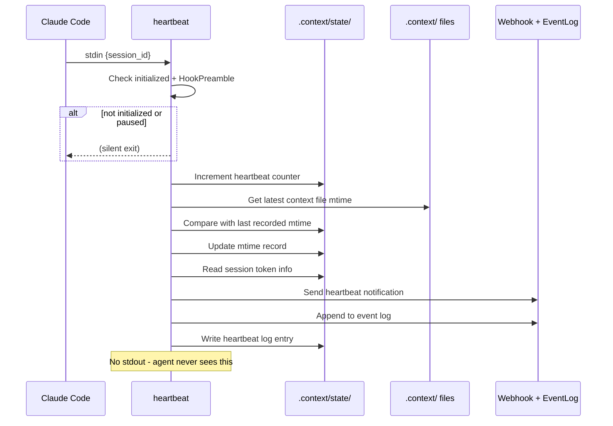
```mermaid
sequenceDiagram
    participant CC as Claude Code
    participant Hook as heartbeat
    participant State as .context/state/
    participant Ctx as .context/ files
    participant Notify as Webhook + EventLog

    CC->>Hook: stdin {session_id}
    Hook->>Hook: Check initialized + HookPreamble
    alt not initialized or paused
        Hook-->>CC: (silent exit)
    end
    Hook->>State: Increment heartbeat counter
    Hook->>Ctx: Get latest context file mtime
    Hook->>State: Compare with last recorded mtime
    Hook->>State: Update mtime record
    Hook->>State: Read session token info
    Hook->>Notify: Send heartbeat notification
    Hook->>Notify: Append to event log
    Hook->>State: Write heartbeat log entry
    Note over Hook: No stdout - agent never sees this
```

---

## Project-Local Hooks

These hooks are configured in `settings.local.json` and are **not**
shipped with ctx. They are specific to individual developer setups.

### Block-Dangerous-Commands

Lifecycle: PreToolUse. Matcher: `Bash`

Blocks dangerous shell patterns (sudo, git push, cp to bin).
No initialization or pause checks: always active.

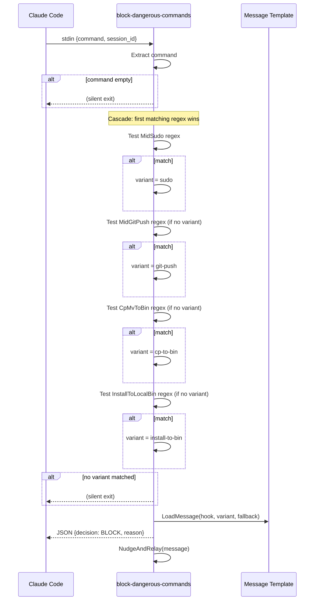
```mermaid
sequenceDiagram
    participant CC as Claude Code
    participant Hook as block-dangerous-commands
    participant Tpl as Message Template

    CC->>Hook: stdin {command, session_id}
    Hook->>Hook: Extract command
    alt command empty
        Hook-->>CC: (silent exit)
    end
    Note over Hook: Cascade: first matching regex wins
    Hook->>Hook: Test MidSudo regex
    alt match
        Hook->>Hook: variant = sudo
    end
    Hook->>Hook: Test MidGitPush regex (if no variant)
    alt match
        Hook->>Hook: variant = git-push
    end
    Hook->>Hook: Test CpMvToBin regex (if no variant)
    alt match
        Hook->>Hook: variant = cp-to-bin
    end
    Hook->>Hook: Test InstallToLocalBin regex (if no variant)
    alt match
        Hook->>Hook: variant = install-to-bin
    end
    alt no variant matched
        Hook-->>CC: (silent exit)
    end
    Hook->>Tpl: LoadMessage(hook, variant, fallback)
    Hook-->>CC: JSON {decision: BLOCK, reason}
    Hook->>Hook: NudgeAndRelay(message)
```

---

## Throttling Summary

| Hook                     | Lifecycle          | Throttle Type         | Scope             |
|--------------------------|--------------------|-----------------------|-------------------|
| context-load-gate        | PreToolUse         | One-shot marker       | Per session       |
| block-non-path-ctx       | PreToolUse         | None                  | Every match       |
| qa-reminder              | PreToolUse         | None                  | Every git command |
| specs-nudge              | PreToolUse         | None                  | Every prompt      |
| post-commit              | PostToolUse        | None                  | Every git commit  |
| check-task-completion    | PostToolUse        | Configurable interval | Per session       |
| check-context-size       | UserPromptSubmit   | Adaptive counter      | Per session       |
| check-ceremonies         | UserPromptSubmit   | Daily marker          | Once per day      |
| check-freshness          | UserPromptSubmit   | Daily marker          | Once per day      |
| check-journal            | UserPromptSubmit   | Daily marker          | Once per day      |
| check-knowledge          | UserPromptSubmit   | Daily marker          | Once per day      |
| check-map-staleness      | UserPromptSubmit   | Daily marker          | Once per day      |
| check-memory-drift       | UserPromptSubmit   | Session tombstone     | Once per session  |
| check-persistence        | UserPromptSubmit   | Adaptive counter      | Per session       |
| check-reminders          | UserPromptSubmit   | None                  | Every prompt      |
| check-resources          | UserPromptSubmit   | None                  | Every prompt      |
| check-version            | UserPromptSubmit   | Daily marker          | Once per day      |
| heartbeat                | UserPromptSubmit   | None                  | Every prompt      |
| block-dangerous-commands | PreToolUse *       | None                  | Every match       |

\* Project-local hook (settings.local.json), not shipped with ctx.

## State File Reference

All state files live in `.context/state/`.

| File Pattern                    | Hook                  | Purpose                                   |
|---------------------------------|-----------------------|-------------------------------------------|
| `ctx-loaded-{session}`          | context-load-gate     | One-shot injection marker                 |
| `ctx-paused-{session}`          | (all)                 | Session pause marker                      |
| `ctx-wrapped-up`                | check-context-size    | Suppress nudges after wrap-up (2h expiry) |
| `freshness-checked`             | check-freshness       | Daily throttle                            |
| `ceremony-reminded`             | check-ceremonies      | Daily throttle                            |
| `journal-reminded`              | check-journal         | Daily throttle                            |
| `knowledge-reminded`            | check-knowledge       | Daily throttle                            |
| `map-staleness-reminded`        | check-map-staleness   | Daily throttle                            |
| `version-checked`               | check-version         | Daily throttle                            |
| `memory-drift-nudged-{session}` | check-memory-drift    | Per-session tombstone                     |
| `ctx-context-count-{session}`   | check-context-size    | Prompt counter                            |
| `stats-{session}.jsonl`         | check-context-size    | Session stats log                         |
| `persist-{session}`             | check-persistence     | Counter + mtime state                     |
| `ctx-task-count-{session}`      | check-task-completion | Prompt counter                            |
| `heartbeat-count-{session}`     | heartbeat             | Prompt counter                            |
| `heartbeat-mtime-{session}`     | heartbeat             | Last context mtime                        |
